## Lab 1 – Azure Cloud Visibility 

### Introduction

In this lab we will use multiple resources including:
* AKS Cluster
* Azure Monitor
* Logs 
* SLOs
* Clouds

### Creating a Notebook to Analyze Logs

1.	*Open* the **Notebooks app**. We will create a notebook to **analyze** the following; **logs coming from our Azure integration**, and **logs coming from our application deployed in AKS**.
2.	*Create* a **new notebook**.

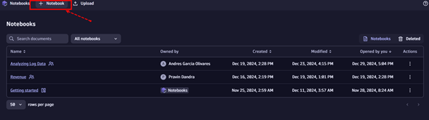  

3.	In our **new notebook**, let's *add* a **new section of DQL**.

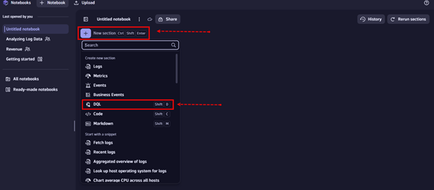 

4.	Inside the **DQL section** that we added, let’s *run* the **following query** that fetches all the records of azure using an azure subscription id as filter:

```
fetch logs
| filter azure.subscription == "7A91E8B3-EE09-4906-91A2-F357B77A61FD"
```

5.	We can use this query to look at all the **logs coming from our azure integration**. We can also *add* **filters** for resource group, resource id, resource name or type. 

```
fetch logs
| filter azure.subscription == "7A91E8B3-EE09-4906-91A2-F357B77A61FD"  and azure.resource.group == "SCW-GROUP-JOEBAILEY"
```

6.	Try to *add* a **new property to your query to filter your results**.
7.	We are also monitoring logs coming from our **AKS cluster**. Let's *add* **another DQL section** to our notebook to *check* these logs with the **next DQL query**.

```
fetch logs
| filter matchesPhrase(k8s.cluster.name, "perform") 
| sort timestamp desc
```

8.	This query is showing **logs** coming from our **AKS cluster** with the name "**perform**". In all these logs we can find useful information about **infrastructure performance** or **business-related** information.
9.	In the **AKS cluster** we have a **hipstershop application** running. This application writes logs that **contains business information** like successful transactions or revenue. Let's *add* another **DQL section** to our notebook, and *run* the **following query** to see the number of succussful transactions.

```
fetch logs
| filter contains(content, "payment") and k8s.namespace.name == "hipstershop"
| parse content, "json:j"
| fields timestamp, loglevel, content, message=j[message], traceid=j[dt.trace_id]
| summarize transactions=count()
```

10.	We have the information, but what about **adding some style** to the visualization? *Go to* the **options button** of our **DQL section** and *change* the **visualization to single value**.

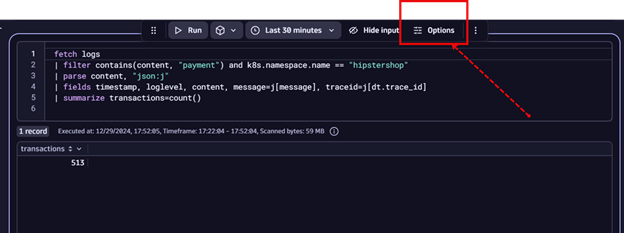  

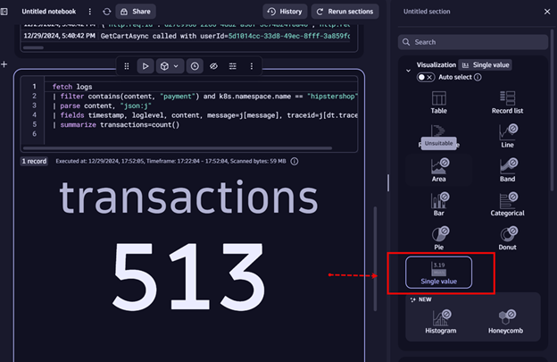  

Better, right?

11.	Now, what about **analyzing the revenue** of these transactions? *Add* another **DQL section** to your notebook and *paste* the **following DQL query**.

```
fetch logs
| filter contains(content, "payment") and k8s.namespace.name == "hipstershop"
| parse content, "json:j"
| fields timestamp, loglevel, content, message=j[message], traceid=j[dt.trace_id]
| parse message, "LD 'USD', double:Amount "
| summarize total_revenue=sum(Amount)
```

12.	Let's reconfigure the visualization to **single value**. Let's also go to the bottom of the **options menu** and *select* the **units and formats option**.

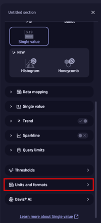  

13.	*Add* an **override**:

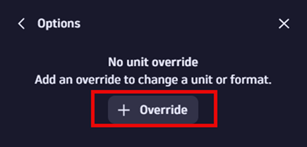  

14.	*Change* the **unit to USD**. Try *typing* **USD in the search option**

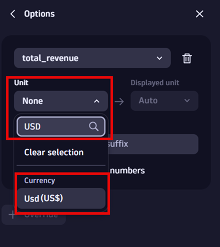  

That looks better.

15.	The idea of using notebooks is to enhance the collaboration in this kind of analysis. Let's *share* the **notebook with the rest of the users** in the environment. At the **top of your notebook**, first *change* the **name** of your notebook. Currently you'll see the title "**Untitled notebook**", *click* on **it** and *change* the **name** to **[your-first-name]-perfom2025**.

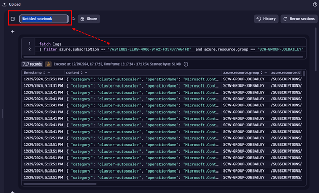  

16.	*Click* on the **share button**

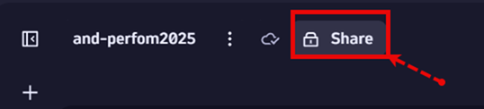  

17.	Once in **the share menu**, *click* on the **gear icon**

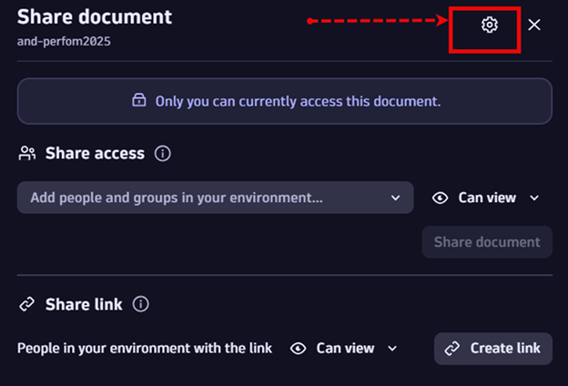  

18.	Finally, *turn on* the **“Visible to anyone in your environment” toggle**.

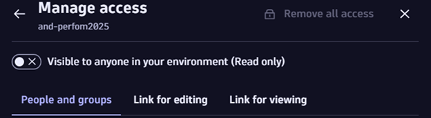  

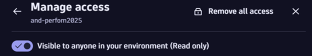  

  

### SLOs
Now we will *create* **Service Level Objectives** (**SLOs**) to *track* the performance of our newly deployed **Azure Cloud**. **Service Level Objectives** will *ensure* that we are maintaining our **standards** and **best practices**.
1.	*Open* up the **Service-level Objectives** (**SLO**) app. 
2.	*Create* a new **SLO**.

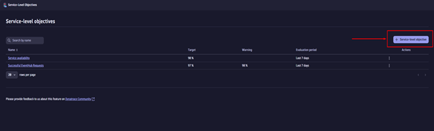  

3.	While Dynatrace offers **preset SLO options** to help you get you started, we will be creating **custom SLOs**. *Select* the **custom SLO** option.

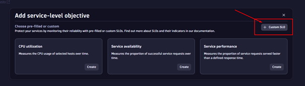  

4.	Here we can *add* our **custom DQL**.
5.	For our first example, we will be *tracking* the number of **Successful EventHub requests**. To do this, we will need to *utilize* **several metrics** that come built-in with the **Azure Event Hub Integration**. 
    * **dt.cloud.azure.event_hub.requests.successful**  - *Tracks* the number of **successful EventHub requests**
    * **dt.cloud.azure.event_hub.errors.server** – *Tracks* the number of **EventHub server errors**
    * **dt.cloud.azure.event_hub.errors.user**  - *Tracks* the number of **EventHub User errors**
    * **dt.cloud.azure.event_hub.errors.quota_exceeded** – *Tracks* the number of **Quota Exceeded errors**
    * **dt.cloud.azure.event_hub.requests.throttled** – *Tracks* **throttled EventHub requests**
6.	*Add* the **following DQL** to *build* your **SLO**: 

```
 timeseries {Successful = sum(dt.cloud.azure.event_hub.requests.successful),
ServerErrors = sum(dt.cloud.azure.event_hub.errors.server),UserErrors = sum(dt.cloud.azure.event_hub.errors.user),QuotaExceededErrors = sum(dt.cloud.azure.event_hub.errors.quota_exceeded),Throttled = sum(dt.cloud.azure.event_hub.requests.throttled)}
| fieldsAdd sli = (((Successful[] - ServerErrors[]- UserErrors[] - QuotaExceededErrors[] - Throttled[]) / Successful[]) * (100))
| fieldsRemove Successful, ServerErrors, UserErrors, QuotaExceededErrors, Throttled
```

7.	*Refresh* the **preview** to ensure that the **SLO** is *reporting* results correctly.

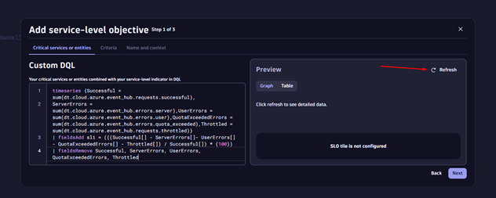  

8.	*Hit* ‘**Next**’. Now, we will *set* our **Target threshold**, **warning threshold**, and **evaluation period**. The **target value** can be a standard set by **your company** or a standard set by **the industry**. We will *use* **98%**. *Toggle* the show **warning** option:

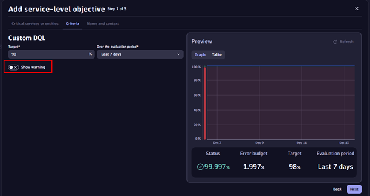  

9. *Set* the **target** to **99%**. Finally, *choose* your **evaluation period**. For this example, we can *use* the **default**, **7 days**.
10.	*Hit* ‘**Next**’. *Give* your **SLO** a **name**, **description**, and any relevant **tags**, and *hit* ‘**Save**’. 
11.	Your first **SLO** is now complete! We will *repeat* this process **twice** more. 
12.	Our next **SLO** will *track* the number of **Azure MySQL** **active connections** versus the **number of aborted connections**. *Repeat* the **steps** from the 1st **SLO** but use this **DQL**: 
```
timeseries { ActiveConnections = sum(cloud.azure.microsoft_dbformysql.flexibleservers.active_connections), AbortedConnections = sum(cloud.azure.microsoft_dbformysql.flexibleservers.aborted_connections) }
| fieldsAdd sli = (((ActiveConnections[] - AbortedConnections[])/ ActiveConnections[]) * (100))
| fieldsRemove ActiveConnections, AbortedConnections
```

13.	We will *repeat* the same **process** for our third **SLO**. The last **SLO** will track our **Azure App Service** and track the % of requests that are *less* than **500ms**. *Use* the **following** **DQL**: 

```
timeseries rsp_time = avg(dt.cloud.azure.app_service.response.avg), default:0
| fieldsAdd high=iCollectArray(if(rsp_time[]> (1000 * 500), rsp_time[]))
| fieldsAdd low=iCollectArray(if(rsp_time[]<= (1000 * 500), rsp_time[]))
| fieldsAdd highRespTimes=iCollectArray(if(isNull(high[]),0,else:1))
| fieldsAdd lowRespTimes=iCollectArray(if(isNull(low[]),0,else:1))
| fieldsAdd sli=100*(lowRespTimes[]/(lowRespTimes[]+highRespTimes[]))
| fieldsRemove rsp_time, high, low, highRespTimes, lowRespTimes
```
14.	We now have 3 **SLOs** set up to *track* various performance objectives across our **Azure** deployment. 
15.	Now, *add* your **SLOs** to a **dashboard** to *display* with other metrics!

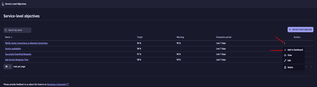  

### Lab 1 Conclusion
In this **lab** we have successfully *created* a **notebook** to *analyze* **logs** and then **SLOs** to *track* our **Azure** deployment performance.

