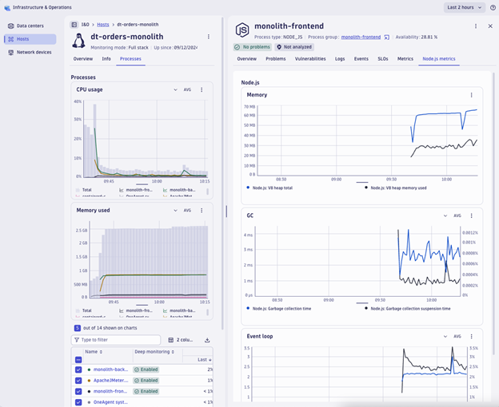

## Lab 2: AWS Cloud Visibility 
### Introduction 
For intelligent **monitoring** of **services** and **infrastructure** running in **Amazon Cloud**, you can integrate Dynatrace with **Amazon Web Services** (**AWS**). The **AWS Cloudwatch integration**, combined with the **OneAgent**, helps you **stay on top of the dynamics** of your **data center** in the **cloud**. 
In this lab we will complete the following objectives:
* *Learn* how to **configure** **Dynatrace** to **integrate with** **AWS** **CloudWatch**
* *Learn* how **AWS CloudWatch** **metrics** can be configured as **metric events** for **anomaly detection** and **automation**
* *Review* how **Dynatrace** can perform **self-healing** tasks with a connection to **AWS** in **workflows**

### Lab Setup

For this lab you are going to set up an **EC2 instance** that runs a **sample application** that you can use to learn the **Dynatrace** **platform** and to review how Dynatrace brings **tremendous insights** all through the **Dynatrace OneAgent**.

#### Dynatrace API Token

1.	*Open* your **Dynatrace tenant** and *navigate* to **dashboards**.
2.	*Open* the **Dashboard** titled “**APItokenDashboard**”. This *contains* your **API token**, with all required **permissions**. *Copy* this **value** and *save* it for later.

#### AWS Account Creation
1. Click on the AWS training and certification workshop link to join the event 

2. Click on Join the event 

3. Input your email to have a code generated for you to login with a 1-time passcode. Copy that passcode into the box below and Sign In

  

4.	Review the Terms and Conditions, Agree, then Join Event

  

5.	In the lower left-hand corner Click on “Open AWS console (us-west-2)

  

#### AWS CLI Lab Setup

1.	*Open* up **CloudShell** in a **new tab**. To *open* the **CloudShell**, *right click* on the **CloudShell** icon at the top of the **AWS console**, and *open* in a **new tab**. This may take a minute to complete. 

In this lab, we will be using **AWS CloudShell**. **CloudShell** is a **browser-based shell** that makes it **easy to securely** **manage**, **explore**, and **interact** with your **AWS resources**.

To *open* the **CloudShell**, *click* on the **CloudShell** icon at the top of the **AWS console**. This may take a *minute* to *complete*.

  

*This may open up a slash page.*

  

2.	After *closing* the **pop-up**, *wait* a minute for the **CloudShell** **to initialize.** When this is done, you will see the **command prompt** as shown below.

  

3.	*Clone* the **workshop scripts**.

Once you have the **CloudShell** open, you need to get some **scripts** that will **automate the** **workshop** setup. *Run* this **command**:
```
git clone https://github.com/Epeiswerth/aws-modernization-dt-orders-setup-saas.git
```
It should look like this:
 
```
[CloudShell-user@ip-10-0-52-50 ~]$ git clone https://github.com/Epeiswerth/aws-modernization-dt-orders-setup-saas.git
 
Cloning into ‘aws-modernization-dt-orders-setup’…
 
remote: Enumerating objects: 161, done.
Remote: Counting objects: 100% (161/161), done.
Remote: Compressing objects: 100% (96/96), done.
Remote: Total 161 (delta 72), reused 143 (delta 60), pack-reused 0
Receiving objects: 100% (161/161), 19.82 MiB | 22.21 MiB/s, done.
Resolving deltas: 100% (72/72), done.
```
#### Provision VM
This step creates **two** **CloudFormation** **stacks** that do the following:
- *Add* **two** **EC2 instance** named: **dt-orders-monolith** and **dt-orders-services**
- At EC2 startup, it *installs* **Docker** and **Docker-Compose**
- At EC2 startup, it *installs* the **OneAgent** for your **Dynatrace** tenant
- Starts up the sample **application** by *running* **docker-compose up**

1.	*Type*:
```
 pwd
 ```
 You *should* be in the **directory**:
 ```
 /home/CloudShell-user
 ```
2.	*Copy* and *run* provisioning **script** **command** *exactly* as described below from the directory **/home/CloudShell-user**
```
cd ~/aws-modernization-dt-orders-setup-saas/provision-scripts && ./provision-workshop.sh https://<<tenantID>>.live.dynatrace.com <<API_Token>> <<Your email used to login to Dynatrace>>
```
 
Within the **AWS SSH shell**, *paste* the full **command** and you should see a **prompt to proceed** as shown below.

```
About to Provision Workshop for:
https://<tenantID>.live.dynatrace.com
SETUP_TYPE   = all
KEYPAIR_NAME = ws-default-keypair
Proceed? (y/n) : 
```
 
Once the **script is complete**, you should *see* **output** as shown below.
 
```
Done Setting up Workshop config
End: Thu Nov  4 01:45:06 UTC 2021
Create AWS resource: monolith-vm
{
    “StackId”: “arn:aws:cloudformation:us-west-2:838488672964:stack/monolith-vm-1635990306/d82cd2b0-3d10-11ec-a495-023df82ab493”
}
```
 
3.	*Verify* **CloudFormation** **Stacks**

The **CloudFormation** may take a few minutes, but you can *check* the **CloudFormation** **output** to ensure that all the **AWS** **resources** were provisioned successfully.

*Monitor* **CloudFormation** stack status *within* the **AWS** **console**. *Navigate* to the **CloudFormation** page or just navigate to:
* [https://console.aws.amazon.com/cloudformation/home](https://console.aws.amazon.com/cloudformation/home)

When it is *complete*, it will show a **CREATE_COMPLETE** status as shown below.

  

#### Create an AWS OIDC Identity Provider for AWS Connector
The **AWS Connector** actions use **OpenID Connect** (**OIDC**) to authenticate with AWS, allowing them to access **AWS resources**. To *configure* **AWS IAM**, we will do the following
1.	On the left side menu, *Add* a new **Identity Provider**.
2.	*Add* an **AWS** role.
      -	*Open* **IAM** in the **AWS** Console > *Click* on **Identity Providers** > **Create Identity Provider**
      -	*Choose* “**OpenID Connect**”
      -	*Enter* in the following details
 
Provider URL: 
```
https://token.dynatrace.com
```
 
Audience: 
 
```
<<TenantID>>.apps.dynatrace.com/app-id/dynatrace.aws.connector
```
 
It should look like this:

  

3.	*Click* “**Add Provider**”
4.	*Click* on the “**Assign role**” button in the upper right hand corner, and *Create* a **new role**

  

5.	*Select* **Trusted entity**
7.	*Choose* “**Web Identity**”
8.	**Identity Provider** should be *set to* “**token.dynatrace.com**”
9. **Audience** should be  

``` 
<<TenantID>>.apps.dynatrace.com/app-id/dynatrace.aws.connector 
``` 
10.	*Click* **Next**
11.	*Choose* these **policies**

```AmazonEC2FullAcess```

```eks-autoscaler-policy```

  

12.	*Click* **Next**
13.	*Give* the **Role** a **Name**:
```
Dynatrace-AWSConnectAdmin
```
14.	It should look *similar* to this 

  

15.	*Create* the **role**, then *view* the **role**
16.	*Copy* the **ARN** of the **role**, and *save* **it** in a **notepad**

  

Now we need to allow your **tenant** to connect to **endpoints** in the **allow-list**. In the **Dynatrace UI**:
1.	*Open* **Settings App (New)**
2.	*Select* **Connections**
3.	*Select* the **Connector** **AWS**
4.	*Add* a new **Connection**
    * Name: 
```
PerformAWSConnect
```
**Role ARN** – *Paste* in the **ARN** you just *saved* from the **AWS console**

5.	*Click* **Create**

  

We need to *allow* your **tenant** to *connect* to **endpoints** in the **allow-list**.
 
6.	In the **settings page**, *select* “**Limit outbound connections**”
 
7.	*Add* to the **allow-list**
```
*.amazonaws.com
```
8.	*Add* another **allow-list** endpoint
```
<<TenantId>>.live.dynatrace.com 
``` 
 
9.	*Save* **Changes**

  

### Components for Lab 2
Referring to the picture below, here are the **components** for lab 2.

  

#### 1. Sample Application

A sample app representing a simple architecture of a **frontend** and **backend** implemented as **Docker containers** that we will review in this lab.

#### 2. Dynatrace monitoring

Alongside an **AWS cloudwatch integration** (which we will revisit in a next step), the **Dynatrace OneAgent** has been installed by the **workshop** **provisioning** **scripts** onto the **EC2 instance** and is communicating to your Dynatrace Tenant.

##### TECHNICAL NOTE

Learn more about the various ways the **OneAgent** can be installed, in the [Dynatrace documentation](https://docs.dynatrace.com/docs/ingest-from)

#### 3. Load generator process

A JMeter process sends **simulated user traffic** to the **sample app** running within a Docker container. You will not need to interact with this container, it just runs in the background.

##### TECHNICAL NOTE:

A real-world scenario would often start with the application components running on a **physical** or **virtualized host** **on-prem** and not “**Dockerized**”. To simplify the workshop, we **“Dockerized”** the application into a **front-end** and **back-end**. In **Dynatrace**, these Docker containers all show up as “**processes**” on a **host** just like a “**non-Dockerized**” **application** will.

#### Sample app

The sample application is called **Dynatrace Orders**. A more **detailed overview** & **source code** can be found on [GitHub](https://github.com/dt-orders/overview). 

#### Get the Public IP to the frontend of the Sample Application

To get the **Public IP**, *open* the **EC2 instances** page in the **AWS console**. On the newly created **host** **dt-orders-monolith** *find* the **Public IP** as shown below.

  

#### View the Sample app in a Browser

To view the application, *paste* the **public IP** using **HTTP**, NOT HTTPS, into a **browser** that will look like this:

  

*Use* the **menu** on the **home page** to *navigate* around the **application**. *Note* the **URL** for key functionality. You will see these **URLs** later as we *analyze* the **application**.

* **Customer List** = customer/list.html
* **Customer Detail** - Each customer has a unique page = customer/5.html
* **Catalog List** = catalog/list.html
* **Catalog Search Form** = catalog/searchForm.html
* **Order List** = order/list.html
* **Order Form** = order/form.html

### OneAgent Data 

*Review* the **Infrastructure and Operations App** to *view* the **Monolith VM**.

  

  

  

  

### Clouds App

In addition to monitoring your **AWS workloads** using **OneAgent**, Dynatrace provides integration with **AWS CloudWatch** which adds **infrastructure monitoring** to gain insight even into all popular **AWS services** (e.g. serverless application scenarios).

#### How this helps
The **AWS** **Cloudwatch** **integration** brings **logs** and additional **metrics** for **cloud infrastructure**, **load balancers**, **API Management Services**, and **more** into the Dynatrace platform. Dynatrace brings value by **enriching the data in context** with **all observability signal**s. 

The **Cloudwatch metrics** are managed by **Dynatrace’s AI engine** **automatically** and this extended observability **improves operations**, **reduces MTTR** and **increases innovation**.

Here is an example, **filtered** for the **AWS account** of this lab:

  

 

The **Clouds** **App** gives you a **unified perspective** among your **multi-cloud inventories** and allows you to drilldown to your relevant set of **cloud services**. For example you can filter by:
* Region
* Service Category (e.g. Databases)
* Service Type (e.g. AWS Lambda)
* Service Name
* Account ID (Environment)
* Tags

<br>
<details>
  <summary>OPTIONAL - Hands-on Exercise – AWS Cloudwatch metric integration</summary>

The steps below were already completed with the Cloudformation template. We will not perform the steps to set up an (additional) integration with AWS cloudwatch to ingest metrics to Dynatrace, but they are here for your reference. 

1.	From the **Clouds App** > **Configure** > **AWS** > **Connect new Instance**
2.	*Add* the **following information**:
- **Connection Name**: 
```
Dynatrace Integration
```

- **Auth method**: Role Based authentication
- **IAM Role**: 
```
Dynatrace_monitoring_role
```
- Your **AWS** **account ID**: found on the **AWS console** **top right-hand dropdown**.
- **Monitor all resources**

*Click* **Save**

  

3.	Once the **connection** is successfully *verified* and *saved*, your **AWS account** will be listed in the **Clouds** app.
</details>


#### Review Collected Metrics

Let’s *navigate* to the **AWS dashboards** that were automatically created as soon as you hooked up the integration with **AWS Cloudwatch**:

  

#### Why is this important? 

The **AWS integration** is a central way to get a **picture** and **metrics** for the **AWS resources** running against your **accounts** as you migrate.

Read more about the **latest AWS integrations** in our [blog](https://www.dynatrace.com/news/blog/new-integrations-announced-at-aws-reinvent-enhance-cloud-performance-security-and-automation/) and review all details about our AWS integrations in the [Dynatrace documentation](https://docs.dynatrace.com/docs/observe/infrastructure-monitoring/cloud-platform-monitoring/aws-monitoring). 

#### Custom Metric Events

Dynatrace Davis **automatically analyzes** abnormal situations within your **IT infrastructure** and attempts to **identify any relevant** **impact** and **root causes**. 

Davis relies on a wide spectrum of information sources, such as a **transactional** **view** of your **services** and **applications**, as well as **all events raised** on individual nodes within your **Smartscape topology**.

 There are two main **sources** for single events in Dynatrace:
1.	**Metric-based events** (events that are triggered by a series of measurements)
2.	**Events** that are independent of any **metric** (for example, **process crashes**, **deployment changes**, and **VM motion events**)

**Custom metric events** are configured in the **global settings** of your **environment**, and are *visible* to all **Dynatrace** users in your **environment**.

### Hands-on Custom Anomaly Detection

**Davis Anomaly Detection** allows you to create **anomaly detectors**, set up **customized alerts**, and **transform** **metric events** configuration. You can also save time and create an **anomaly detector** in **Notebooks** while using the **app**. We will be using the **metrics** *captured* from **AWS**.

1.	*Go* to the app **Davis Anomaly Detection**.
2.	*Select* the **“Settings”** dropdown in the upper right-hand corner, *select* **Authorization Settings**, and *select* **All permissions**.
3.	*Select* **Anomaly Detector** > **Create your own Anomaly Detector**.
4.	*Give* your configuration a meaningful **Title**, like: 

```
High EC2 CPU Usage %
```  

5.	*Expand* Configure your query and *provide* the **DQL query** to *fetch* your **data**.
6.	**DQL Query**: 
```
timeseries max(dt.host.cpu.usage), by: {dt.entity.ec2_instance, dt.source_entity}
| lookup [fetch `dt.entity.EC2_INSTANCE`
  | fields id, entity.name, tags, awsInstanceId], sourceField:dt.entity.ec2_instance, lookupField:id
| fieldsAdd EC2Tags = lookup.tags, awsInstanceId = lookup.awsInstanceId
| expand EC2Tags
| filter EC2Tags == "[AWS]Name:dt-orders-monolith"
```
7.	**Actor**: Yourself
##### Customize Parameters
1. **Analyzers:** Static threshold anomaly detection
2. **Threshold**: 70
3.	*Click* on “**Show Advanced Properties**”. *Change* the **values** to:
      - **Violating Samples**: 1  
      - **Sliding Window**: 3 
      - **Dealerting samples**: 3

  

4.	**Alert condition**: Alert if Metric is Above
5.  *Create* an **Event Template**
- **Event Name**: 
```
High EC2 CPU Usage %
```
- Event Description: 
```
The EC2 CPU Usage on {dims:dt.source_entity} exceeded {threshold} with AWS tags {dims:EC2Tags}
```
-	*Configure* your **Event Properties** to look like this

  

   - Add the key value pairs 
```
AWS_Tags : {dims:EC2Tags}
AWS_Instance_ID : {dims:lookup.awsInstanceId}
```
9.	*Click* **Create**.

### AWS Connect for Workflows

*Open* the **AWS CLI**.

#### Trigger Workflow with Problem Card

We are going to create a **self-healing** **workflow** that gets triggered from the **anomaly detection** **event** you just created for the **EC2** **CPU usage**. This workflow will take advantage of the **AWS Connector integration**. **AWS Connector** enables your Dynatrace environment to interact with different **AWS Services** based on **events** and **schedules** defined in a dedicated **workflow**.

In a **workflow**, you can **query** and *manipulate* **AWS** resources, such as **EC2 instances** or **S3 buckets**. **AWS Connector** provides an extensive set of **workflows** actions, which *offer* a familiar interface very closely aligned with **AWS CLI** so that you can use *actions* and *concepts* that are already well known to you.

#### Create EC2 Reboot workflow

1.	To authorize the service account running this workflow, in the **upper right hand corner**, *click* on “**Settings**” then *select* “**Authorization settings**”

  

2.	*Grant* **all** **Permissions** and *Close* the **popup window**. The below message indicates that there are **some** **permissions** that could not be granted to the **workflow service account** because the group you are a part of does not have them granted in the **policy**. They are not needed for this lab.

  

3.	*Click* on the **Workflows App** > *click* on “**+Workflow**”
4.	*Select* Trigger: **On demand trigger**
5.	*Click* on add **task** right below trigger box
6.	*Search* for **actions**, and *select*: 
```
EC2: Describe instances
```
7.	In the **Connection** space, *find* the **Connection** you just *built* “**PerformAWSConnect**”
8.	In the **region** section, *click* on the code box “**Add Expression**” on the right hand side of the region field. *Delete* all the curly brackets and type: 
```
us-west-2
```
9.	In **Filters** *enter* the following
```
tag:Name
```
 
```
dt-orders-monolith
```
10.	*Click* **Save**, then **Run**
11.	Once it runs successfully, *click* on the **action** in the **workflow** and it should show the result as shown below. You can *expand* the result to see the list of **VM instances** and their **IDs**. We will *parse* this result to pull out the **instance ID** for the next step.

  

12.	*Add* another task, “**EC2 Reboot Instances**”
13.	In the **region section**, *click* on the code box “**Add Expression**” on the right hand side of the region field. *Delete* all the curly brackets and type: 
```
us-west-2
 ```
14.	*Add* this **parameter** in the “**instanceIds**” field, and *Save* the **Workflow**
``` 
{{result("ec2_describe_instances_1").Reservations[0].Instances[0].InstanceId}}
```

 

15. *Save* your **workflow** 
15.	*Change* the **trigger** type to “**Davis problem trigger**”
16.	*Describe* the **trigger** as seen below to recognize the **custom event** type from your **anomaly detection rule**.

  

17.	*Filter* on **tags** with the **key:value pair**:
 ```
 [AWS]Name
 ```
 ```
 dt-orders-monolith
 ```
18.	*Save* the **Workflow**
19.	*Change* the name of the **workflow** to “**Reboot Monolith VM**” by *clicking* on the **title**. Then *Save* the **Workflow** again.

#### Trigger Custom Problem Alerts
##### SSH to monolith host
 
We are going to manually trigger a **CPU problem** on the **monolith VM**. This will **generate a problem** from your **custom anomaly detection rule** and will trigger the **EC2 reboot workflow**. 

To connect to the host, simply use **EC2 Instance Connect**. To do this, *navigate* to the **EC2 instances** page in the **AWS console**.

From the list, *pick* the **dt-orders-monolith** (1) and then the **Connect button** (2) as shown below.

  

Then on the next page, *choose* the **EC2 Instance Connect** option and then the **connect button**.

  

Once you're connected, you will see the terminal prompt like below.
```
Welcome to Ubuntu 20.04.2 LTS (GNU/Linux 5.4.0-1045-aws x86_64)
...
...
To run a command as administrator (user "root"), use "sudo <command>".
See "man sudo_root" for details.
ubuntu@ip-10-0-0-118:~$ 
```
 
1. Using a **unix utility yes**, we can generate **CPU stress** just by *running* the **yes command** a few times.
In the terminal, *copy* **all these lines** and *run* **them**:
```
yes > /dev/null &
yes > /dev/null &
yes > /dev/null &
```
To verify, *run* this **command**:
```
ps -ef | grep yes
```
The output should look like this:
```
ubuntu    5802  5438 99 20:48 pts/0    00:00:05 yes
ubuntu    5805  5438 89 20:48 pts/0    00:00:04 yes
ubuntu    5806  5438 97 20:48 pts/0    00:00:03 yes
ubuntu    5818  5438  0 20:48 pts/0    00:00:00 grep --color=auto yes
```
2.	Back in Dynatrace within the **Infrastructure and Operations view**, the CPU should now be high, as shown below:

  

3.	It may take a minute or so, but you will get a **problem card** shown below. #1 is the alert from the **severity = RESOURCE** where Davis AI was invoked, and #2 is the alert from **severity = CUSTOM ALERT**.

  

4.	*Navigate* back to the **Workflows App** and find the **workflow you just created**
5.	*Click* on the **ellipsis button** to view the execution history

  

6.	It should show a successful run that was triggered by the Davis AI detected **custom alert problem**:

  

##### *(Optional – If the workflow does not correctly reboot your VM)*
To stop the problem, you need to *kill* the **processes**. To do this:
1.	Back in **CloudShell**, *run* this **command** to get the **process IDs** 

``` 
ps -ef | grep yes 
```

2.	For each **process**, *copy* the **process ID** and *run* **kill** <PID\>

For example:
##### If the output is this...
 ```
ubuntu@ip-10-0-0-118:~$ ps -ef | grep yes
ubuntu    5802  5438 99 20:48 pts/0    00:00:05 yes
ubuntu    5805  5438 89 20:48 pts/0    00:00:04 yes
ubuntu    5806  5438 97 20:48 pts/0    00:00:03 yes
 ```
##### Then run...
 ```
kill 5802
kill 5805
kill 5806
```

Or better to use the below **command** to *kill* all the **PID’s** at once

```
kill $(ps -ef | grep yes | awk '{print $2}' | sed '$d')
```
Or even more effective is:

```
pkill yes
```

3.	*Verify* they are gone by *running* this again: 

```
ps -ef | grep yes
```

4.	*Verify* that **CPU** in Dynatrace goes to normal and the **problems** will eventually *automatically* close.
5.	*Exit* the **SSH**: Simply type **“exit”** to return to the **CloudShell**.

### Lab 2 Conclusion
In this section, you have completed the following:
- Review how Dynatrace integrates with **AWS CloudWatch**
- Review how **Infrastructure metrics** can be configured as **Metric events** for alerts
- Review how Dynatrace can perform **self-healing** tasks with a connection to **AWS** in **workflows**
