## Lab 3 – Kubernetes Observability and EKS Autoscaling Workflow 

### Introduction 

In this lab, we will learn how to observe and **troubleshoot Kubernetes clusters** with Dynatrace. We will use the **out-of-the-box health assessment** provided by Dynatrace to detect and analyze a reliability issue. Additionally, we will build a workflow to **automate a self-healing action** for this use case.  

For the hands-on part of this lab, we will showcase the integration with **AWS EKS** via Dynatrace Operator (on top of the Cloudwatch integration). We will create a workflow and you will see the workflow execution **triggered by Dynatrace Davis AI**. 

#### Lab Prerequisites

The following assets / scripts have already been triggered in Lab 2: 
- Create CloudFormation Stacks by executing provisionWorkshop.sh script 
- Create an AWS OIDC Identity Provider for AWS Connector  
- Create AWS connection and allow outbound connection to AWS APIs (“AWS Connect for Workflows”) 
- Authorization Settings in Workflow App for Service User are granted 
 
### Lab Setup 

For this lab you are going to use an **updated version of the order application** in Kubernetes. This makes it easy for you to see the **transformation of the Sample Application** in Lab 2 and the value of running Kubernetes on AWS without needing to stand up or maintain your own Kubernetes control plane. 

#### Verify CloudFormation Stacks

We have automated the EKS setup for this lab by leveraging CloudFormation stacks. As this has been already included in the initial workshop provisioning script triggered in Lab 2, we should already have an EKS cluster with 2 nodes as well as an integration with Dynatrace up and running. Please check the **CloudFormation output** to ensure that all the **AWS resources were provisioned successfully**. 

*Navigate* to the **CloudFormation page** to check the status in the AWS console: 
- [https://console.aws.amazon.com/cloudformation/home](https://console.aws.amazon.com/cloudformation/home) 

When it is complete, it will show a **CREATE_COMPLETE** status as shown below. 

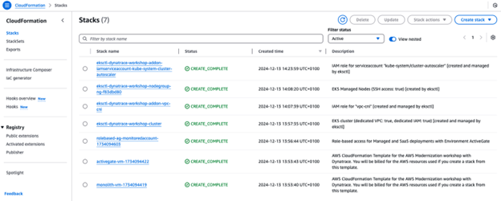  

#### Verify Cluster within AWS Console

With the AWS Console, *search* for the “**Elastic Kubernetes Service**” or *click* on the **link below**.
- [https://console.aws.amazon.com/eks/home#/clusters](https://console.aws.amazon.com/eks/home#/clusters)

On the **cluster page**, *click* on cluster “**dynatrace-workshop**”. 

Next *click* on the **compute** tab. You will see **2 Kubernetes nodes** managed by one node group. 

*Click* on the **NodeGroup** and *review* the **details**. The node group is managed by an **EC2 Autoscaling group** with a lower (Minimum size) and upper (Maximum size) boundary.

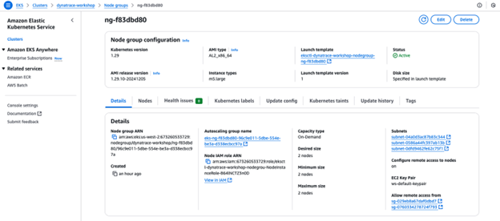  

### Deploy App on EKS

For this lab, another version of the application, used in Lab 2, exists that breaks out each of these **backend services** into **separate services**. By putting these services into container images, we gain the ability to deploy the service into **containerized workloads in EKS**.

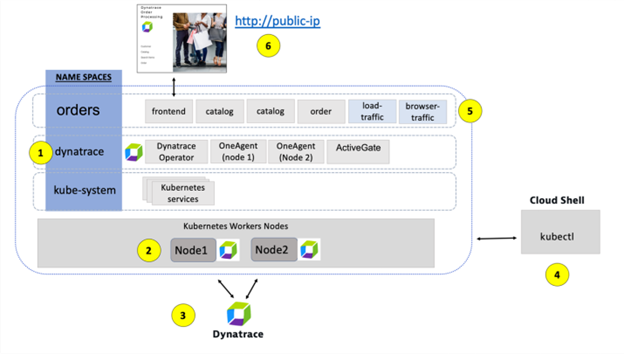  

#### Deploy sample app on EKS

*Copy* & *paste* the **following command** in your **AWS cloud shell** to *deploy* the **sample app**

```
 cd ~/aws-modernization-dt-orders-setup-saas/app-scripts
./start-k8.sh
```

The output should look similar to this:

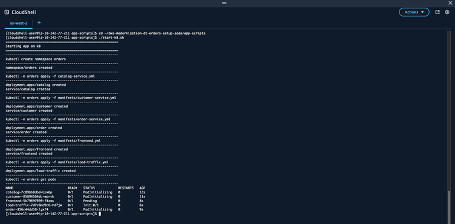  

Note the status **“Pending”** of the frontend pod. We will revisit that in a later step. 

### Dynatrace on EKS - Dynatrace Operator

One key Dynatrace advantage is **ease of activation**. OneAgent technology **simplifies deployment** across large enterprises and **relieves engineers** of the burden of instrumenting their applications by hand. As Kubernetes adoption continues to grow, it becomes more important than ever to **simplify the activation of observability** across workloads without sacrificing the deployment automation that Kubernetes provides. 

The Dynatrace Operator **automates the deployment** of required Dynatrace components within Kubernetes clusters. Observability should be **as cloud-native as Kubernetes** itself. In our workshop, we have already pre-installed the Dynatrace Operator via helm in the initial provisioning script.
 
*Verify* Dynatrace Deployment in EKS using **kubectl**
1.	*Open* **CloudShell**
2.	(Optional – as already installed: *install* **kubectl**)
3.	*Run* the **following commands**: 
```
 kubectl get dynakube -n dynatrace
```
```
 kubectl get pod -n dynatrace
```
 
*Verify* that the DynaKube (Dynatrace Custom Resource) and all pods in the Dynatrace namespace are **ready & running**. 

```
[cloudshell-user@ip-10-142-77-211 app-scripts]$ kubectl get dynakube -n dynatrace
NAME               APIURL                                    STATUS    AGE
workshop-cluster   https://tqp85835.live.dynatrace.com/api   Running   55m
[cloudshell-user@ip-10-142-77-211 app-scripts]$ kubectl get po -n dynatrace
NAME                                  READY   STATUS    RESTARTS   AGE
dynatrace-oneagent-csi-driver-9ttw2   4/4     Running   0          56m
dynatrace-oneagent-csi-driver-bcqcl   4/4     Running   0          56m
dynatrace-operator-58bd4995bf-r2t7b   1/1     Running   0          56m
dynatrace-webhook-d6f748f58-5wg2k     1/1     Running   0          56m
workshop-cluster-activegate-0         1/1     Running   0          56m
workshop-cluster-oneagent-7q2md       1/1     Running   0          56m
workshop-cluster-oneagent-gj6gg       1/1     Running   0          56m
```


<details>
  <summary>Optional - Deploy Dynatrace in a Kubernetes cluster</summary>

*Open* the **Kubernetes App** in your Dynatrace tenant and *click* on “**Add cluster**” in the **upper right corner**. 

The **Kubernetes App** guides you through **onboarding a new K8s cluster to Dynatrace via helm**. More information about the different deployment options can be found in our [documentation](https://docs.dynatrace.com/docs/ingest-from/setup-on-k8s).

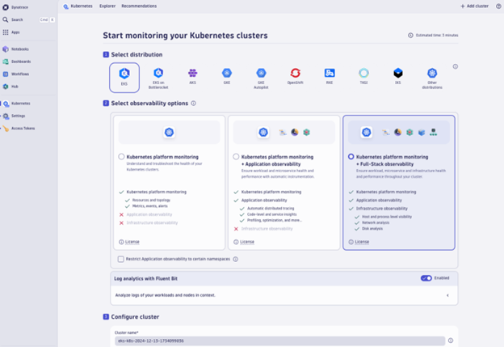
</details>

### Kubernetes Observability with Dynatrace

#### Dynatrace Kubernetes App

*Open* the **Kubernetes app** in the **Dynatrace platform**. 

You will immediately get a first overview of the **health state** of the most important Kubernetes objects within your K8s clusters. Notice the links to **ready-made** dashboards for various Kubernetes object types (e.g. Node - Pods).

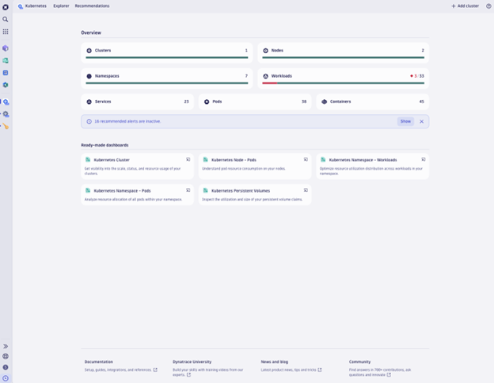  

Note the **info message highlighting** that there are some out-of-the-box alerts are inactive. You can investigate the list of health alerts that are available out of the box by either *clicking* on **“show”** in this info message or by *switching* to the **“Recommendations”** tab in the K8s App.

**Out-of-the-box health alerts**

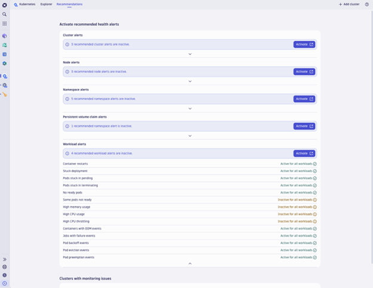  

*Expand* the workload alerts section. You can see that most of the **workload alerts** are activated out of the box. *Click on “Activate”* to view or change the settings for workload alerts. You will get redirected to the Classic Settings app. 

To speed things up for our Hands-on-session, we’ve adapted the default configuration for detecting anomalies for pending pods. Expand the configuration for the “Detect pods stuck in pending”anomaly detection. The anomaly detector is configured to alert if there has been a pod stuck in pending for at least 2 minutes within the last 3 minutes as shown below.

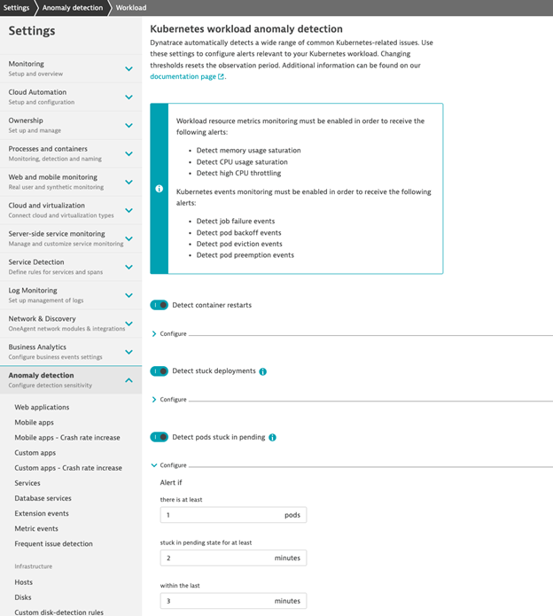  

#### Kubernetes Explorer
- *Navigate* to the **Kubernetes Explorer**
- *Explore* the **unhealthy workloads** by directly *clicking* on the **number of unhealthy workloads** in the **health status** above the cluster table.

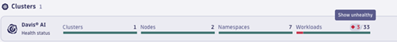  

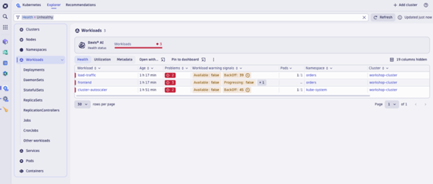  

*Analyze* the unhealthy workload **“frontend”** in namespace **“orders”**.

Dynatrace provides all **Observability signals** in context (metrics, logs, events, traces) of this workload and shows you why it is unhealthy.

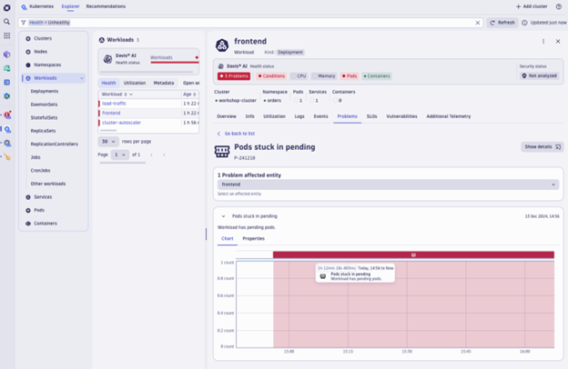  

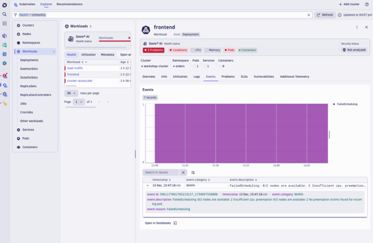  

In this case, the pod can’t be scheduled as there are **not sufficient resources available** on any node.

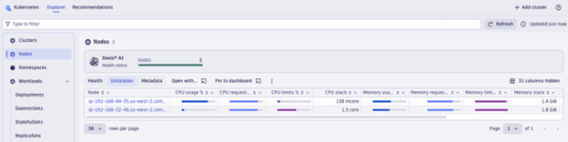  

Do you remember the initial EKS setup? Didn’t we have a **node autoscaler** in place? 
As it turns out, the **maximum Size** of the Autoscaling Group was already reached (2 nodes). Can we prevent such a problem in the future?

### K8s/AWS Workflows with AWS EC2 APIs

Knowing what Observability data is available within Dynatrace and how to manipulate it using **DQL** is a great first step. The next step is to understand **how to automate processes** within our organization using that information. Dynatrace allows users to **trigger actions from workflows** and apply **self-healing actions** so you don’t need to wake up SREs or Clouds Ops teams on weekends or during nights. 

We do not have enough time to create another workflow from scratch in this lab, so let’s **import a workflow from a template**. 

1.	*Download* the workflow template from [the GitHub repository](https://github.com/Epeiswerth/aws-modernization-dt-orders-setup-saas/blob/main/wftpl_manage-eks-autoscaling-group-size-workflow.yaml)
2.   *Open* **Workflow App** in Dynatrace
3.	*Select* **“Upload”** in the **upper right corner**
4.	*Select* and *open* the **manage-eks-autoscaling-group-size-workflow.yaml file** in the Github repository
5.	*Check* the **required apps** and *click* **“Next”**

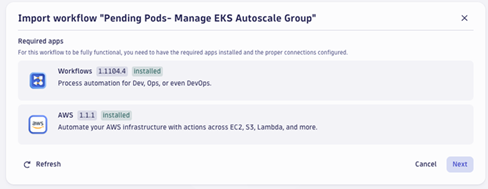  

6.	*Select* the AWS connection **“PerformAWSConnect”** created in Lab 2 and *Import* Workflow

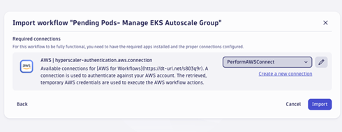  

Analyze each step in the workflow and *make sure* the **Davis Problem Trigger is enabled**.

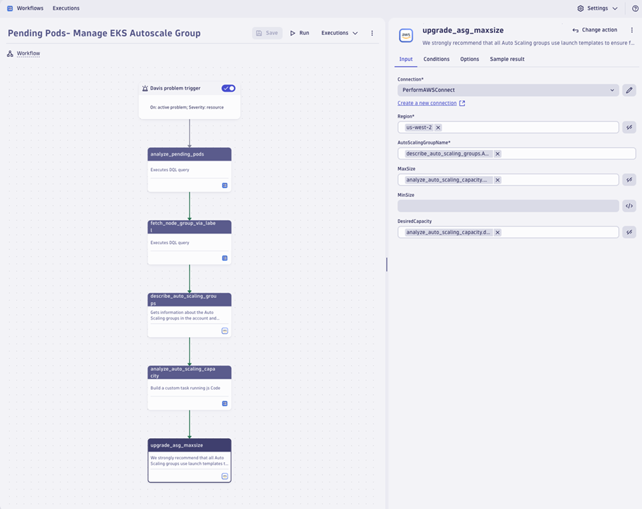  

- **Davis Problem Trigger**
     - The workflow gets triggered **when Davis AI detects a reliability problem** in with a pod stuck in pending. For our example, we scoped the workflow action to only trigger this workflow if the problem occurs for the namespace of one of our most important apps called **“orders”**. 
- **Analyze Pending Pods**
     - In this initial step, we double-check whether there is a pending pod that is **not already marked for deletion**.  
- **Fetch node group labels**
     - Next, we determine the node group that is **most likely the one that lead to the pending pod** due to **insufficient resource coverage**. For this purpose, we’re analyzing the utilization of the nodes and take the node group including the node with the highest utilization. 
     - ***Note***: We took a shortcut in this example to keep the complexity of the workflow and the amount of instrunctions for this HoT session at a managebel level. To be 100% precise, we’d need to check the **taints** and **tolerations** of the pending pod as well as matching node groups. You can setup & connect [Dynatrace EdgeConnect](https://docs.dynatrace.com/docs/ingest-from/edgeconnect) for this purpose to retrieve the full yaml from the pod and nodes via Kubernetes API and use it in a workflow action. 
     - Moreover, we have some **exciting updates** in our roadmap section.
- **Describe Auto Scaling Group (ASG)**
     - We *use* the EC2 Action “Describe auto scaling group” to get the name of the EC2 autoscaling group based on the **EKS nodegroup name**. This action sends a request to the **AWS EC2 Autoscaling API**.
- **Analyze Auto Scaling Capacity**
     - This action executes **javascript code** where we analyze the current, desired and maximum capacity of the Autoscaling Group. In case the desired capacity is already at the **maximum level**, we *increase* the **maximum ASG size by 2**. 
     - ***Note***: If you don’t have a cluster autoscaler in place, you can update the desired capacity with this Dynatrace workflow, too. 
- **Upgrade Auto Scaling Group Max Size**
     - We *use* the EC2 Action “Update auto scaling group” to send a request to the **EC2 autoscaling API** and update the **ASG with the parameters defined** in the previous step. 

**Workflow Execution**

*Check* whether the workflow has been already **successfully executed**. If not, *select* **Davis problem trigger**, *click* on “**query past events**,” and then *run* the **workflow manually**.

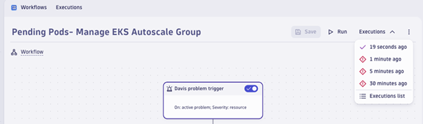  

Check the number of Kubernetes nodes in the Dynatrace Kubernetes App (or AWS console). You should now see **3 Kubernetes nodes** and **no longer any pod stuck in pending**!

***Note***: The workflow has increased the maximum Size in the Autoscaling Group from 2 to 4 instances. It takes quite some time (~10 minutes) until this change is reflected in the EKS node group details displayed in the AWS Console. While the Autoscaling group information is updated ad-hoc, unfortunately you don’t have sufficient permissions with your workshop participant AWS user to access it.
