## Lab 4 – AWS Infra Logs via Firehose
### Introduction 

In this lab, we will learn how to integrate **Cloud platform events** with **Dynatrace**. **Platform events** are mostly generated in the form of **logs** when **services** are being instantiated. It's critical that we get these **logs** and **events** into a **centralized platform** so that the ops team can **troubleshoot with ease**. 

For the hands-on part of this lab, we will showcase the integration with **AWS services via CloudWatch** and **Data Firehose**. We will get various **logs from EKS** and at the end of the lab you will be able to see these logs within Dynatrace in near real-time.

Lab Prerequisites

* *Access* to **AWS account** with the relevant **permissions** to *create* an **EKS cluster** and **Kinesis Data Firehose**
* Able to *navigate* through **AWS console** with ease

### Lab Steps

We will follow instructions from **Dynatrace** **documentation** to *create* the **Firehose Delivery Pipeline**: [https://docs.dynatrace.com/docs/ingest-from/amazon-web-services/integrate-with-aws/aws-logs-ingest/lma-stream-logs-with-firehose](https://docs.dynatrace.com/docs/ingest-from/amazon-web-services/integrate-with-aws/aws-logs-ingest/lma-stream-logs-with-firehose)

***Tip***: To successfully *execute* the request below, you need an **access token** with ```logs.ingest``` scope.

To learn how to *create* **API** key, see this: [https://docs.dynatrace.com/docs/manage/identity-access-management/access-tokens-and-oauth-clients/access-tokens#create-api-token](https://docs.dynatrace.com/docs/manage/identity-access-management/access-tokens-and-oauth-clients/access-tokens#create-api-token )
 
***Step 1.*** *Execute* the below **commands** while in the **AWS console** (note the **live.dynatrace.com URI, and NO trailing “/”)

``` 
DYNATRACE_API_URL=<<your_API_URL>>
``` 
(e.g., DYNATRACE_API_URL=https://sur12345.live.dynatrace.com)
``` 
DYNATRACE_API_KEY=<<your_API_token>>
```
(e.g., DYNATRACE_API_KEY=dt0a01.sur12345.1211asdsdfaesdf56...asdfasdfdf) 
** Note: This api key is available in your dashboard under ApiTokenDashboard)
```
STACK_NAME=dynatrace-log-delivery-stream
```
 
``` 
wget -O dynatrace-firehose-log-stream.yaml https://assets.cloud.dynatrace.com/awslogstreaming/dynatrace-firehose-log-stream.yaml && \
aws cloudformation deploy --capabilities CAPABILITY_NAMED_IAM --template-file ./dynatrace-firehose-log-stream.yaml --stack-name $STACK_NAME --parameter-overrides DtApiUrl=$DYNATRACE_API_URL DtApiToken=$DYNATRACE_API_KEY 
```

Sample Output:

```
CloudWatchSubscriptionFilterRoleArn
arn:aws:iam::133220408703:role/dynatrace-log-delivery-stream-CloudWatchLogsRole-wgg3reyD7A73
FirehoseArn
arn:aws:firehose:ap-northeast-1:133220408703:deliverystream/dynatrace-log-delivery-stream	 
```

***Step 2.*** Once the **Firehose Stream** is in “**active**” state, test the connection between **AWS** and **Dynatrace** by *sending* **demo data**.
- *Open* **Data Firehose** in **Amazon Console**.
- *Click* the “**dynatrace-log-delivery-stream**" you created
- *Click* “**Test with demo data**”

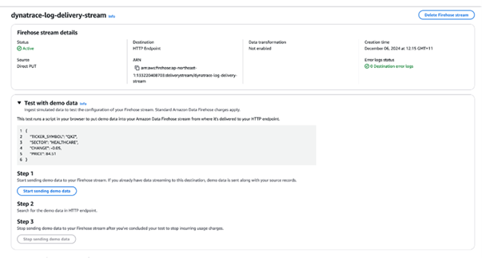  

- Inside your **DT tenant**, *open* **Logs App**
- *Create* **logs filter** with the **ARN** for **data firehose**
- *Use* the **ARN of your resource to filter** the logs

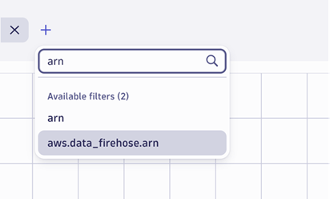  

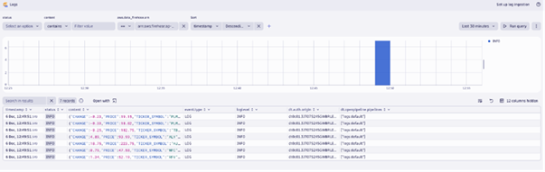  

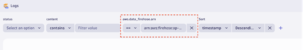  

***Step 3.*** Now let’s onboard the logs from the **EKS cluster** into Dyntrace.
   
In the **EKS cluster** you created earlier, *navigate* to the “**Observability**” tab and *open* “**Manage logging**”

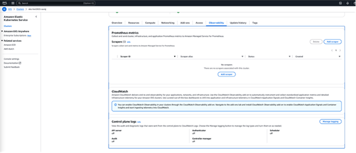  

*Select* the **sources** you’d like to **log**, and *save* your **changes**. 

In the below screenshot you see that all the **platform-level logs** are *selected*:

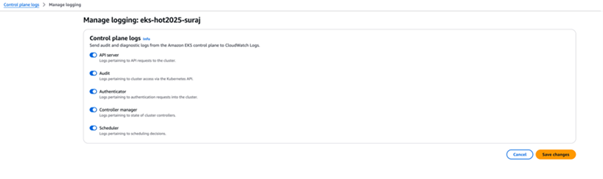  

***Step 4.*** Let’s *subscribe* to the **log group** where **EKS** *sends* those **platform logs**.
- *Open* **CloudWatch**
- *Navigate* to **Log Groups**

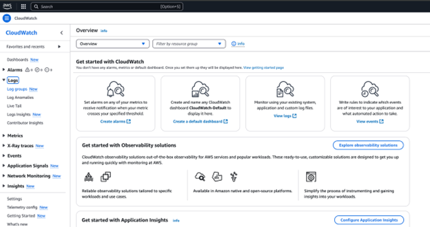  

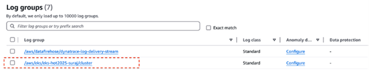  

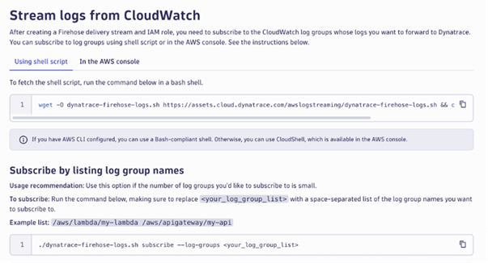  

*Execute* the below commands on your **AWS Cloud shell**:
``` 
wget -O dynatrace-firehose-logs.sh https://assets.cloud.dynatrace.com/awslogstreaming/dynatrace-firehose-logs.sh && chmod +x dynatrace-firehose-logs.sh 
``` 

``` 
./dynatrace-firehose-logs.sh subscribe --log-groups /aws/eks/dynatrace-workshop/cluster 
``` 

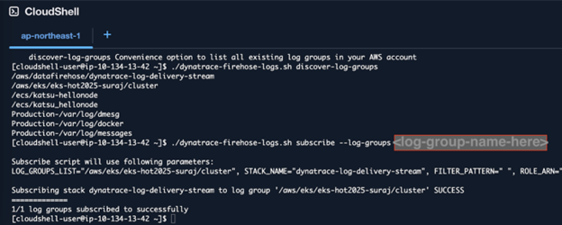 

Once you have **subscribed**, you can see those **logs** within your **Dynatrace tenant**:

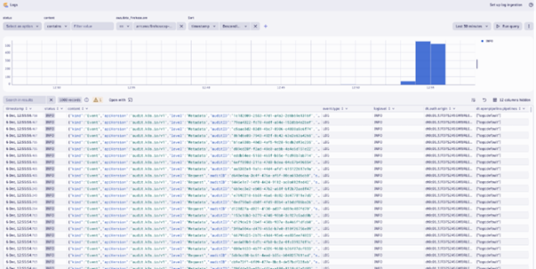  

<details>
<summary>Optional Appendix for Lab 4</summary>
Use this guide in the case where your **EKS cluster is not running** and you need to **create a new one** just to complete this lab.

***Step 1***. *Open* **AWS Cloudshell**

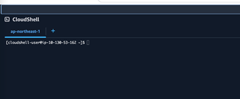  

***Step 2.*** The **eksctl CLI** is used to work with **EKS clusters**. It automates many individual tasks. 
 
The below commandline is to *install* **EKSCTL**. These are taken from: [https://eksctl.io/installation/](https://eksctl.io/installation/)

```
ARCH=amd64
PLATFORM=$(uname -s)_$ARCH
curl -sLO https://github.com/eksctl-io/eksctl/releases/latest/download/eksctl_$PLATFORM.tar.gz
curl -sL "https://github.com/eksctl-io/eksctl/releases/latest/download/eksctl_checksums.txt" | grep $PLATFORM | sha256sum –check
tar -xzf eksctl_$PLATFORM.tar.gz -C /tmp && rm eksctl_$PLATFORM.tar.gz
sudo mv /tmp/eksctl /usr/local/bin
```

***Step 3.*** You can now go ahead and *create* a **cluster using the below command**. Remember to *change* the **name of the cluster and the region**.

```
eksctl create cluster --name suraj-hot-perform2025 --region ap-northeast-1 --fargate
``` 

***Step 4.*** You should be able to see the progress of the **EKS cluster creation** within **CloudFormation** -> **Stacks**.

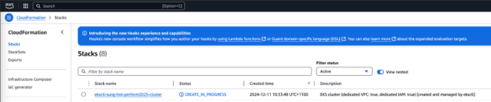  

***Step 5.*** *Clean up* **EKS**

```
eksctl delete cluster --name suraj-hot-perform2025 --region ap-northeast-1
```
</details>
